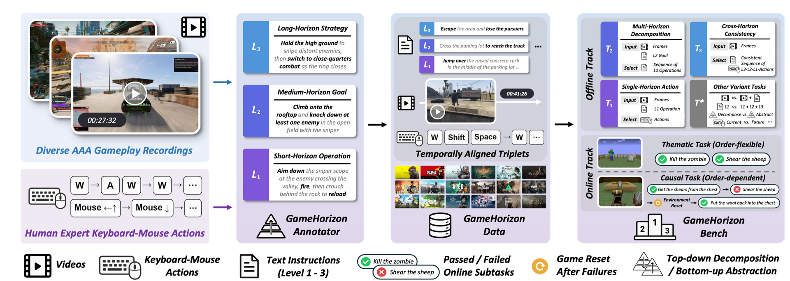

<div align="center">
  

  <p>
    <a href="https://gamehorizon-suite.github.io"></a>
    <a href="https://arxiv.org/abs/2609.25001"></a>
    <a href="https://gamehorizon-suite.github.io/#benchmark"></a>
    <br>
    <a href="#"></a>
    <a href="#"></a>
    <a href="LICENSE"></a>
  </p>

  <p>
    <a href="https://raymondwang987.github.io">Yiran Wang</a><sup>1,*,†</sup>, <a href="https://flow0314.github.io">Xingyilang Yin</a><sup>1,2,6,*</sup>, <a href="https://pujunfu.github.io">Junfu Pu</a><sup>1,*</sup>, <a href="https://wangguangzhi.com">Guangzhi Wang</a><sup>1,*</sup>, Kaifeng Li<sup>2</sup>, 
    <a href="http://mingyuouyang.com">Mingyu Ouyang</a><sup>1,3</sup>, <a href="https://scholar.google.com.hk/citations?user=CafUdpEAAAAJ">Huiqiang Sun</a><sup>1,4</sup>, 
    <br>
    <a href="https://lg-li.github.io">Lingen Li</a><sup>1,5</sup>, <a href="https://scholar.google.com.hk/citations?user=QfKnJ7oAAAAJ">Cheng Cheng</a><sup>1</sup>, <a href="https://drexubery.github.io">Wangbo Yu</a><sup>1</sup>, 
    <a href="https://scholar.google.com.hk/citations?user=j_yFqlsAAAAJ">Honghao Chen</a><sup>1</sup>, <a href="https://vinthony.github.io/academic/">Xiaodong Cun</a><sup>1,2,✉</sup>, <a href="https://cmpun.github.io">Chi-Man Pun</a><sup>6</sup>, <a href="https://scholar.google.com.hk/citations?user=396o2BAAAAAJ">Zhiguo Cao</a><sup>4</sup>, <a href="https://scholar.google.com.hk/citations?user=4oXBp9UAAAAJ">Ying Shan</a><sup>1</sup>
  </p>
  <p><sub>
    <sup>1</sup>ARC Lab, Tencent &nbsp; <sup>2</sup>GVC Lab, Great Bay University &nbsp; <sup>3</sup>NUS &nbsp; <sup>4</sup>HUST &nbsp; <sup>5</sup>MMLab, CUHK &nbsp; <sup>6</sup>University of Macau<br>
    † Project Lead &nbsp;&nbsp; * Equal Contribution &nbsp;&nbsp; ✉ Corresponding Author
  </sub></p>
</div>

---

## 📢 News

- **[2026.09.22]** 📄 The [paper](https://arxiv.org/abs/2609.25001) and [project page](https://gamehorizon-suite.github.io) of GameHorizon Suite are released!
- We will progressively release the **code**, **benchmark**, and **data** starting around **2026.10.25**. Stay tuned! ⭐

## 🚀 Open-Source Plan

We are actively preparing the release of our code, benchmark, and data. Star the repo to follow our progress.

- [x] 🌐 [Project page](https://gamehorizon-suite.github.io)
- [x] 📄 [Technical report / paper](https://arxiv.org/abs/2609.25001) 
- [x] 🏆 [Public leaderboard](https://gamehorizon-suite.github.io/#benchmark)
- [ ] 🏗️ GameHorizon-Annotator — annotation toolkit & pipeline
- [ ] 📊 GameHorizon-Bench (offline) — MCQ suite & evaluation code
- [ ] 📊 GameHorizon-Bench (online) — online task environments
- [ ] 🎯 GameHorizon-Data — 5,000-hour AAA gameplay corpus


## 📖 Overview

<div align="left"></div>

<p align="justify">
We introduce <strong>GameHorizon</strong>, a large-scale data and evaluation suite spanning multiple horizons and AAA games. It serves as a unified yardstick across a broad range of model types. It consists of three key components. <strong>GameHorizon-Annotator</strong> automatically produces a three-level pyramid of short-horizon operations, medium-horizon goals, and long-horizon strategies. <strong>GameHorizon-Data</strong> contains 5,000 hours of gameplay across 21 game titles, with temporally aligned videos, actions, and multi-horizon instructions. <strong>GameHorizon-Bench</strong> provides reproducible offline and stepwise online testing. The offline track contains thousands of standardized MCQs across three primary tasks and diagnostic variants. The online track tests order-dependent causal and order-flexible thematic tasks via the verifiable subtasks for failure localization.
</p>


<table>
<thead>
<tr>
<th align="left">Component</th>
<th align="left">What it is</th>
<th align="left">Highlights</th>
</tr>
</thead>
<tbody>
<tr>
<td nowrap>🏗️ Annotator</td>
<td>A scalable and automated annotation pipeline</td>
<td><strong>L1 → L2 → L3 instruction pyramid</strong></td>
</tr>
<tr>
<td nowrap>🎯 Data</td>
<td>A large-scale AAA gameplay corpus</td>
<td><strong>5,000 hours</strong> · <strong>AAA-focused</strong> · <strong>21 titles</strong> · <strong>temporally-aligned videos, actions &amp; multi-horizon instructions</strong></td>
</tr>
<tr>
<td nowrap>📊 Bench</td>
<td>Reproducible offline + stepwise online track</td>
<td><strong>5,000 offline MCQs (3 primary + 10 variant tasks)</strong> · <strong>20 online tasks / 62 subtasks</strong> · <strong>47 models benchmarked</strong></td>
</tr>
</tbody>
</table>


## 🏆 Leaderboard

### Offline Results — Primary Tasks (T1 / T2 / T3)

Accuracies are reported as percentages. **Overall** is the mean across the three tasks. 

**Bold** = best, <ins>underline</ins> = second-best. Models are grouped into four tiers by Overall score.


<div align="left"><b>Average (all 44 models)</b> — T1 57.3 · T2 65.1 · T3 71.6 · <b>Overall 64.7</b></div>

<div align="center">

<table>
<tr>
<td valign="top">

<b>🥇 Tier 1 · Rank 1–11</b>

<table>
<tr><th align="center">#</th><th align="left">Model</th><th align="center">T1</th><th align="center">T2</th><th align="center">T3</th><th align="center">Overall</th></tr>
<tr><td align="center">🥇</td><td align="left">GPT-6-Astra</td><td align="center"><strong>69.4</strong></td><td align="center">79.6</td><td align="center"><strong>91.5</strong></td><td align="center"><strong>80.2</strong></td></tr>
<tr><td align="center">🥈</td><td align="left">Gemini 3.8 Flash</td><td align="center">65.9</td><td align="center"><strong>81.2</strong></td><td align="center"><ins>84.8</ins></td><td align="center"><ins>77.3</ins></td></tr>
<tr><td align="center">🥉</td><td align="left">Gemini 3.7 Flash</td><td align="center"><ins>66.2</ins></td><td align="center"><ins>80.1</ins></td><td align="center">83.9</td><td align="center">76.7</td></tr>
<tr><td align="center">4</td><td align="left">Gemini 3.6 Flash</td><td align="center">62.3</td><td align="center">79.1</td><td align="center">84.6</td><td align="center">75.3</td></tr>
<tr><td align="center">5</td><td align="left">GPT-5.6 Sol</td><td align="center">65.3</td><td align="center">77.5</td><td align="center">81.5</td><td align="center">74.8</td></tr>
<tr><td align="center">6</td><td align="left">Kimi-K3</td><td align="center">64.4</td><td align="center">79.3</td><td align="center">79.7</td><td align="center">74.5</td></tr>
<tr><td align="center">7</td><td align="left">Gemini 3.5 Flash</td><td align="center">64.9</td><td align="center">77.4</td><td align="center">80.8</td><td align="center">74.4</td></tr>
<tr><td align="center">8</td><td align="left">GPT-5.5</td><td align="center">64.6</td><td align="center">78.9</td><td align="center">76.2</td><td align="center">73.2</td></tr>
<tr><td align="center">9</td><td align="left">Gemini 3.1 Pro</td><td align="center">64.5</td><td align="center">75.8</td><td align="center">78.2</td><td align="center">72.8</td></tr>
<tr><td align="center">10</td><td align="left">Doubao-Seed-2.1-Turbo</td><td align="center">63.1</td><td align="center">79.4</td><td align="center">75.5</td><td align="center">72.7</td></tr>
<tr><td align="center">11</td><td align="left">Doubao-Seed-2.1-Pro</td><td align="center">62.9</td><td align="center">76.7</td><td align="center">76.6</td><td align="center">72.1</td></tr>
</table>

</td>
<td valign="top">

<b>Tier 2 · Rank 12–22</b>

<table>
<tr><th align="center">#</th><th align="left">Model</th><th align="center">T1</th><th align="center">T2</th><th align="center">T3</th><th align="center">Overall</th></tr>
<tr><td align="center">12</td><td align="left">Doubao-Seed-2.0-Pro</td><td align="center">59.2</td><td align="center">74.9</td><td align="center">80.0</td><td align="center">71.4</td></tr>
<tr><td align="center">13</td><td align="left">Claude Fable 5</td><td align="center">62.9</td><td align="center">72.7</td><td align="center">78.1</td><td align="center">71.2</td></tr>
<tr><td align="center">14</td><td align="left">GPT-5.6 Terra</td><td align="center">62.1</td><td align="center">75.6</td><td align="center">74.4</td><td align="center">70.7</td></tr>
<tr><td align="center">15</td><td align="left">Qwen3.7-Plus</td><td align="center">58.8</td><td align="center">75.9</td><td align="center">71.5</td><td align="center">68.7</td></tr>
<tr><td align="center">16</td><td align="left">Qwen3.8-27B</td><td align="center">59.9</td><td align="center">77.4</td><td align="center">68.1</td><td align="center">68.5</td></tr>
<tr><td align="center">17</td><td align="left">GPT-5.6 Luna</td><td align="center">61.6</td><td align="center">70.7</td><td align="center">71.1</td><td align="center">67.8</td></tr>
<tr><td align="center">17</td><td align="left">Kimi-K2.6</td><td align="center">61.2</td><td align="center">73.2</td><td align="center">69.0</td><td align="center">67.8</td></tr>
<tr><td align="center">19</td><td align="left">Doubao-Seed-2.0-Lite</td><td align="center">55.2</td><td align="center">69.0</td><td align="center">76.3</td><td align="center">66.8</td></tr>
<tr><td align="center">20</td><td align="left">Gemma 4 31B-IT</td><td align="center">53.8</td><td align="center">68.6</td><td align="center">76.6</td><td align="center">66.3</td></tr>
<tr><td align="center">21</td><td align="left">MiniMax-M3</td><td align="center">57.8</td><td align="center">68.5</td><td align="center">70.6</td><td align="center">65.6</td></tr>
<tr><td align="center">22</td><td align="left">Qwen3-VL-235B-A22B-Thinking</td><td align="center">58.2</td><td align="center">71.6</td><td align="center">65.9</td><td align="center">65.2</td></tr>
</table>

</td>
</tr>
</table>

<table>
<tr>
<td valign="top">

<b>Tier 3 · Rank 23–33</b>

<table>
<tr><th align="center">#</th><th align="left">Model</th><th align="center">T1</th><th align="center">T2</th><th align="center">T3</th><th align="center">Overall</th></tr>
<tr><td align="center">23</td><td align="left">Claude Opus 4.8</td><td align="center">59.1</td><td align="center">62.1</td><td align="center">73.1</td><td align="center">64.8</td></tr>
<tr><td align="center">24</td><td align="left">Claude Sonnet 5</td><td align="center">54.4</td><td align="center">57.7</td><td align="center">82.0</td><td align="center">64.7</td></tr>
<tr><td align="center">25</td><td align="left">Step-3.7-Flash</td><td align="center">57.5</td><td align="center">71.3</td><td align="center">63.4</td><td align="center">64.1</td></tr>
<tr><td align="center">26</td><td align="left">Qwen3-VL-235B-A22B-Instruct</td><td align="center">55.1</td><td align="center">62.1</td><td align="center">73.1</td><td align="center">63.4</td></tr>
<tr><td align="center">27</td><td align="left">GLM-5V-Turbo</td><td align="center">53.4</td><td align="center">65.4</td><td align="center">70.8</td><td align="center">63.2</td></tr>
<tr><td align="center">28</td><td align="left">GPT-5.2</td><td align="center">58.9</td><td align="center">58.9</td><td align="center">70.6</td><td align="center">62.8</td></tr>
<tr><td align="center">29</td><td align="left">Qwen3.5-397B-A17B</td><td align="center">53.3</td><td align="center">60.1</td><td align="center">73.5</td><td align="center">62.3</td></tr>
<tr><td align="center">30</td><td align="left">BAGEL-7B-MoT</td><td align="center">51.7</td><td align="center">57.3</td><td align="center">75.1</td><td align="center">61.4</td></tr>
<tr><td align="center">31</td><td align="left">Qwen2.5-VL-32B-Instruct</td><td align="center">54.8</td><td align="center">58.0</td><td align="center">69.7</td><td align="center">60.8</td></tr>
<tr><td align="center">32</td><td align="left">Step3-VL-10B</td><td align="center">55.4</td><td align="center">64.7</td><td align="center">61.7</td><td align="center">60.6</td></tr>
<tr><td align="center">33</td><td align="left">SenseNova-U1-8B-MoT</td><td align="center">48.2</td><td align="center">59.2</td><td align="center">67.5</td><td align="center">58.3</td></tr>
</table>

</td>
<td valign="top">

<b>Tier 4 · Rank 34–44</b>

<table>
<tr><th align="center">#</th><th align="left">Model</th><th align="center">T1</th><th align="center">T2</th><th align="center">T3</th><th align="center">Overall</th></tr>
<tr><td align="center">34</td><td align="left">Qwen3.6-35B-A3B</td><td align="center">53.3</td><td align="center">52.9</td><td align="center">66.3</td><td align="center">57.5</td></tr>
<tr><td align="center">35</td><td align="left">Qwen3-Omni-30B-A3B-Instruct</td><td align="center">52.5</td><td align="center">55.6</td><td align="center">63.7</td><td align="center">57.3</td></tr>
<tr><td align="center">36</td><td align="left">GELab-Zero-4B-Preview</td><td align="center">51.8</td><td align="center">46.8</td><td align="center">72.7</td><td align="center">57.1</td></tr>
<tr><td align="center">37</td><td align="left">Qwen2.5-VL-7B-Instruct</td><td align="center">52.0</td><td align="center">54.3</td><td align="center">63.7</td><td align="center">56.7</td></tr>
<tr><td align="center">38</td><td align="left">InternVL3.5-8B</td><td align="center">51.8</td><td align="center">50.2</td><td align="center">65.5</td><td align="center">55.8</td></tr>
<tr><td align="center">39</td><td align="left">GLM-4.1V-9B-Thinking</td><td align="center">54.9</td><td align="center">54.8</td><td align="center">55.3</td><td align="center">55.0</td></tr>
<tr><td align="center">40</td><td align="left">GPT-4o</td><td align="center">55.7</td><td align="center">46.3</td><td align="center">61.3</td><td align="center">54.4</td></tr>
<tr><td align="center">41</td><td align="left">UI-TARS-1.5-7B</td><td align="center">49.1</td><td align="center">47.1</td><td align="center">62.9</td><td align="center">53.0</td></tr>
<tr><td align="center">42</td><td align="left">Ovis-U1-3B</td><td align="center">44.7</td><td align="center">39.6</td><td align="center">59.2</td><td align="center">47.8</td></tr>
<tr><td align="center">43</td><td align="left">InternVL3.5-2B</td><td align="center">45.1</td><td align="center">40.3</td><td align="center">54.7</td><td align="center">46.0</td></tr>
<tr><td align="center">44</td><td align="left">InternVL-U-4B</td><td align="center">46.1</td><td align="center">37.9</td><td align="center">49.8</td><td align="center">44.6</td></tr>
</table>

</td>
</tr>
</table>

</div>

### Online Results — Long Horizon Tasks and Short-Horizon Subtasks

Each entry reports the success rate (%) with the number of passed tasks in parentheses. 

**The offline and online rankings show a clear positive association.**

| Online | Model | Offline | Short-Horizon Subtasks | Long-Horizon Tasks | Causal | Thematic |
|:--:|:--|:--:|:--:|:--:|:--:|:--:|
| 🥇 | GPT-6-Astra | 1 | **66.1**&nbsp;<sub>(41/62)</sub> | **45.0**&nbsp;<sub>(9/20)</sub> | **40.0**&nbsp;<sub>(4/10)</sub> | **50.0**&nbsp;<sub>(5/10)</sub> |
| 🥈 | Gemini 3.6 Flash | 4 | <ins>56.5</ins>&nbsp;<sub>(35/62)</sub> | <ins>30.0</ins>&nbsp;<sub>(6/20)</sub> | <ins>30.0</ins>&nbsp;<sub>(3/10)</sub> | <ins>30.0</ins>&nbsp;<sub>(3/10)</sub> |
| 🥉 | Kimi-K3 | 6 | 46.8&nbsp;<sub>(29/62)</sub> | 10.0&nbsp;<sub>(2/20)</sub> | 20.0&nbsp;<sub>(2/10)</sub> | 0.0&nbsp;<sub>(0/10)</sub> |
| 4 | GPT-5.6 Terra | 14 | 37.1&nbsp;<sub>(23/62)</sub> | 10.0&nbsp;<sub>(2/20)</sub> | 20.0&nbsp;<sub>(2/10)</sub> | 0.0&nbsp;<sub>(0/10)</sub> |
| 5 | GPT-5.6 Luna | 17 | 33.9&nbsp;<sub>(21/62)</sub> | 10.0&nbsp;<sub>(2/20)</sub> | 10.0&nbsp;<sub>(1/10)</sub> | 10.0&nbsp;<sub>(1/10)</sub> |
| 6 | MiniMax-M3 | 21 | 29.0&nbsp;<sub>(18/62)</sub> | 10.0&nbsp;<sub>(2/20)</sub> | 10.0&nbsp;<sub>(1/10)</sub> | 10.0&nbsp;<sub>(1/10)</sub> |
| 7 | GLM-5V-Turbo | 27 | 27.4&nbsp;<sub>(17/62)</sub> | 5.0&nbsp;<sub>(1/20)</sub> | 10.0&nbsp;<sub>(1/10)</sub> | 0.0&nbsp;<sub>(0/10)</sub> |
| 8 | Qwen3.5-397B-A17B | 29 | 19.4&nbsp;<sub>(12/62)</sub> | 5.0&nbsp;<sub>(1/20)</sub> | 10.0&nbsp;<sub>(1/10)</sub> | 0.0&nbsp;<sub>(0/10)</sub> |
| 9 | Step3-VL-10B | 32 | 14.5&nbsp;<sub>(9/62)</sub> | 5.0&nbsp;<sub>(1/20)</sub> | 10.0&nbsp;<sub>(1/10)</sub> | 0.0&nbsp;<sub>(0/10)</sub> |
| 10 | Qwen3.6-35B-A3B | 34 | 11.3&nbsp;<sub>(7/62)</sub> | 5.0&nbsp;<sub>(1/20)</sub> | 10.0&nbsp;<sub>(1/10)</sub> | 0.0&nbsp;<sub>(0/10)</sub> |
| 11 | InternVL3.5-8B | 38 | 3.2&nbsp;<sub>(2/62)</sub> | 0.0&nbsp;<sub>(0/20)</sub> | 0.0&nbsp;<sub>(0/10)</sub> | 0.0&nbsp;<sub>(0/10)</sub> |
| 12 | UI-TARS-1.5-7B | 41 | 1.6&nbsp;<sub>(1/62)</sub> | 0.0&nbsp;<sub>(0/20)</sub> | 0.0&nbsp;<sub>(0/10)</sub> | 0.0&nbsp;<sub>(0/10)</sub> |


## 📜 Citation

If you find GameHorizon Suite useful, please consider citing:

```bibtex
@article{GameHorizonSuite2026,
      title={GameHorizon Suite: Multi-Horizon Data and Evaluation in Gameplay}, 
      author={Yiran Wang and Xingyilang Yin and Junfu Pu and Guangzhi Wang and Kaifeng Li and Mingyu Ouyang and Huiqiang Sun and Lingen Li and Cheng Cheng and Wangbo Yu and Honghao Chen and Xiaodong Cun and Chi-Man Pun and Zhiguo Cao and Ying Shan},
      year={2026},
      journal={arXiv preprint arXiv:2609.25001},
      url={https://arxiv.org/abs/2609.25001}, 
}
```

---

<div align="center"><sub>© 2026 ARC Lab, Tencent · GameHorizon Suite</sub></div>
