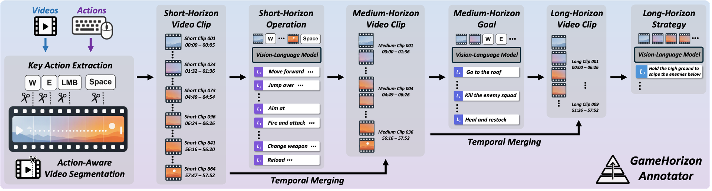
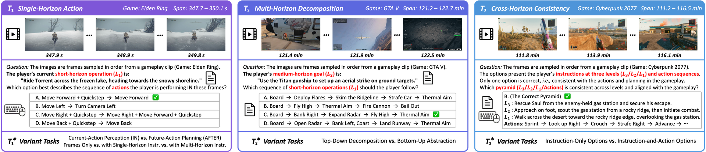
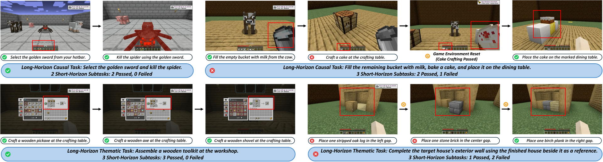

<div align="center">
  

  <p>
    <a href="https://gamehorizon-suite.github.io"></a>
    <a href="#"></a>
    <a href="https://gamehorizon-suite.github.io/#benchmark"></a>
    <br>
    <a href="#"></a>
    <a href="#"></a>
    <a href="LICENSE"></a>
  </p>

  <p>
    <a href="https://raymondwang987.github.io">Yiran Wang</a><sup>1,*,†</sup>, <a href="https://flow0314.github.io">Xingyilang Yin</a><sup>1,2,6,*</sup>, <a href="https://pujunfu.github.io">Junfu Pu</a><sup>1,*</sup>, <a href="https://wangguangzhi.com">Guangzhi Wang</a><sup>1,*</sup>, Kaifeng Li<sup>2</sup>, 
    <a href="http://mingyuouyang.com">Mingyu Ouyang</a><sup>1,3</sup>, <a href="https://scholar.google.com.hk/citations?user=CafUdpEAAAAJ">Huiqiang Sun</a><sup>1,4</sup>, 
    <br>
    <a href="https://lg-li.github.io">Lingen Li</a><sup>1,5</sup>, <a href="https://scholar.google.com.hk/citations?user=QfKnJ7oAAAAJ">Cheng Cheng</a><sup>1</sup>, <a href="https://drexubery.github.io">Wangbo Yu</a><sup>1</sup>, 
    <a href="https://scholar.google.com.hk/citations?user=j_yFqlsAAAAJ">Honghao Chen</a><sup>1</sup>, <a href="https://vinthony.github.io/academic/">Xiaodong Cun</a><sup>1,2,✉</sup>, <a href="https://cmpun.github.io">Chi-Man Pun</a><sup>6</sup>, <a href="https://scholar.google.com.hk/citations?user=396o2BAAAAAJ">Zhiguo Cao</a><sup>4</sup>, <a href="https://scholar.google.com.hk/citations?user=4oXBp9UAAAAJ">Ying Shan</a><sup>1</sup>
  </p>
  <p><sub>
    <sup>1</sup>ARC Lab, Tencent &nbsp; <sup>2</sup>GVC Lab, Great Bay University &nbsp; <sup>3</sup>NUS &nbsp; <sup>4</sup>HUST &nbsp; <sup>5</sup>MMLab, CUHK &nbsp; <sup>6</sup>University of Macau<br>
    † Project Lead &nbsp;&nbsp; * Equal Contribution &nbsp;&nbsp; ✉ Corresponding Author
  </sub></p>
</div>

---

## 📢 News

- **[2026.09.22]** 📄 The [paper]() and [project page](https://gamehorizon-suite.github.io) of GameHorizon Suite are released!
- We will progressively release the **code**, **benchmark**, and **data** starting around **2026.10.25**. Stay tuned! ⭐

## 🚀 Open-Source Plan

We are actively preparing the release of our code, benchmark, and data. Star the repo to follow our progress.

- [x] 🌐 [Project page](https://gamehorizon-suite.github.io)
- [x] 📄 [Technical report / paper]() 
- [x] 🏆 [Public leaderboard](https://gamehorizon-suite.github.io/#benchmark)
- [ ] 🏗️ GameHorizon-Annotator — annotation toolkit & pipeline
- [ ] 📊 GameHorizon-Bench (offline) — MCQ suite & evaluation code
- [ ] 📊 GameHorizon-Bench (online) — online task environments
- [ ] 🎯 GameHorizon-Data — 5,000-hour AAA gameplay corpus


## 📖 Overview

We introduce **GameHorizon**, a large-scale data and evaluation suite spanning multiple horizons and AAA games. It serves as a unified yardstick across a broad range of model types. It consists of three key components. **GameHorizon-Annotator** automatically produces a three-level pyramid of short-horizon operations, medium-horizon goals, and long-horizon strategies. **GameHorizon-Data** contains 5,000 hours of gameplay across 21 game titles, with temporally aligned videos, actions, and multi-horizon instructions. **GameHorizon-Bench** provides reproducible offline and stepwise online testing. The offline track contains thousands of standardized MCQs across three primary tasks and diagnostic variants. The online track tests order-dependent causal and order-flexible thematic tasks via the verifiable subtasks for failure localization.

<div align="left"></div>


| Component | What it is | Highlights |
|:--|:--|:--|
| 🏗️ **Annotator** | A scalable and automated annotation pipeline | **L1 → L2 → L3** instruction pyramid |
| 🎯 **Data** | A large-scale AAA gameplay corpus | **5,000 hours** · **AAA-focused** · **21 titles** · temporally-aligned videos, actions & multi-horizon instructions |
| 📊 **Bench** | Reproducible offline + stepwise online track | **5,000 offline MCQs** (3 primary + 10 variant tasks) · **20 online tasks / 62 subtasks** · **47 models** benchmarked |


## 🏗️ GameHorizon-Annotator

Videos and actions are first processed by **action-aware segmentation** to produce short-horizon clips, with key
actions determining their temporal boundaries. A VLM annotates each clip with an **L1** operation. Lower-level clips
are progressively merged into medium- and long-horizon clips based on action continuity and semantic coherence, from
which the VLM derives **L2** goals and **L3** strategies — abstracting fine-grained trajectories into a pyramid of
multi-horizon text instructions.

<div align="center"></div>


## 🎯 GameHorizon-Data

The first large-scale **AAA** gameplay dataset with temporally aligned videos, player actions, and multi-horizon
instructions, collected by **100 experienced human players** across five diverse genres (open-world, action RPG,
competitive shooter, sandbox survival, and creature-collecting adventure).

<div align="center">

| 📦 Total | 🎮 Titles | 🧑‍🤝‍🧑 Players | 🎬 Genres | 🪜 Horizons |
|:--:|:--:|:--:|:--:|:--:|
| **5,000 h** | **21 AAA** | **100** | **5** | **L1 / L2 / L3** |

</div>


## 📊 GameHorizon-Bench

**Offline track** — reproducible multiple-choice evaluation across three primary tasks (single-horizon action **T1**,
multi-horizon decomposition **T2**, cross-horizon consistency **T3**) plus ten diagnostic variants.

<div align="center"></div>

**Online track** — stepwise, interactive evaluation on long-horizon **causal** and **thematic** tasks, each composed
of verifiable short-horizon subtasks. A task is passed only when all constituent subtasks succeed.

<div align="center"></div>


## 🏆 Leaderboard

### Offline Results — Primary Tasks (T1 / T2 / T3)

Accuracies are reported as percentages; **Overall** is the mean across the three tasks. **Bold** = best, <ins>underline</ins> = second-best.

#### 🥇 Tier 1

| Rank | Model | T1 | T2 | T3 | **Overall** |
|:--:|:--|:--:|:--:|:--:|:--:|
| 🥇 | GPT-6-Astra | **69.4** | 79.6 | **91.5** | **80.2** |
| 🥈 | Gemini 3.8 Flash | 65.9 | **81.2** | <ins>84.8</ins> | <ins>77.3</ins> |
| 🥉 | Gemini 3.7 Flash | <ins>66.2</ins> | <ins>80.1</ins> | 83.9 | 76.7 |
| 4 | Gemini 3.6 Flash | 62.3 | 79.1 | 84.6 | 75.3 |
| 5 | GPT-5.6 Sol | 65.3 | 77.5 | 81.5 | 74.8 |
| 6 | Kimi-K3 | 64.4 | 79.3 | 79.7 | 74.5 |
| 7 | Gemini 3.5 Flash | 64.9 | 77.4 | 80.8 | 74.4 |
| 8 | GPT-5.5 | 64.6 | 78.9 | 76.2 | 73.2 |
| 9 | Gemini 3.1 Pro | 64.5 | 75.8 | 78.2 | 72.8 |
| 10 | Doubao-Seed-2.1-Turbo | 63.1 | 79.4 | 75.5 | 72.7 |
| 11 | Doubao-Seed-2.1-Pro | 62.9 | 76.7 | 76.6 | 72.1 |

<details>
<summary><b>Show full leaderboard (all 44 models, 4 tiers)</b></summary>

| Rank | Model | T1 | T2 | T3 | **Overall** |
|:--:|:--|:--:|:--:|:--:|:--:|
| 🥇 | GPT-6-Astra | **69.4** | 79.6 | **91.5** | **80.2** |
| 🥈 | Gemini 3.8 Flash | 65.9 | **81.2** | <ins>84.8</ins> | <ins>77.3</ins> |
| 🥉 | Gemini 3.7 Flash | <ins>66.2</ins> | <ins>80.1</ins> | 83.9 | 76.7 |
| 4 | Gemini 3.6 Flash | 62.3 | 79.1 | 84.6 | 75.3 |
| 5 | GPT-5.6 Sol | 65.3 | 77.5 | 81.5 | 74.8 |
| 6 | Kimi-K3 | 64.4 | 79.3 | 79.7 | 74.5 |
| 7 | Gemini 3.5 Flash | 64.9 | 77.4 | 80.8 | 74.4 |
| 8 | GPT-5.5 | 64.6 | 78.9 | 76.2 | 73.2 |
| 9 | Gemini 3.1 Pro | 64.5 | 75.8 | 78.2 | 72.8 |
| 10 | Doubao-Seed-2.1-Turbo | 63.1 | 79.4 | 75.5 | 72.7 |
| 11 | Doubao-Seed-2.1-Pro | 62.9 | 76.7 | 76.6 | 72.1 |
| 12 | Doubao-Seed-2.0-Pro | 59.2 | 74.9 | 80.0 | 71.4 |
| 13 | Claude Fable 5 | 62.9 | 72.7 | 78.1 | 71.2 |
| 14 | GPT-5.6 Terra | 62.1 | 75.6 | 74.4 | 70.7 |
| 15 | Qwen3.7-Plus | 58.8 | 75.9 | 71.5 | 68.7 |
| 16 | Qwen3.8-27B | 59.9 | 77.4 | 68.1 | 68.5 |
| 17 | GPT-5.6 Luna | 61.6 | 70.7 | 71.1 | 67.8 |
| 17 | Kimi-K2.6 | 61.2 | 73.2 | 69.0 | 67.8 |
| 19 | Doubao-Seed-2.0-Lite | 55.2 | 69.0 | 76.3 | 66.8 |
| 20 | Gemma 4 31B-IT | 53.8 | 68.6 | 76.6 | 66.3 |
| 21 | MiniMax-M3 | 57.8 | 68.5 | 70.6 | 65.6 |
| 22 | Qwen3-VL-235B-A22B-Thinking | 58.2 | 71.6 | 65.9 | 65.2 |
| 23 | Claude Opus 4.8 | 59.1 | 62.1 | 73.1 | 64.8 |
| 24 | Claude Sonnet 5 | 54.4 | 57.7 | 82.0 | 64.7 |
| 25 | Step-3.7-Flash | 57.5 | 71.3 | 63.4 | 64.1 |
| 26 | Qwen3-VL-235B-A22B-Instruct | 55.1 | 62.1 | 73.1 | 63.4 |
| 27 | GLM-5V-Turbo | 53.4 | 65.4 | 70.8 | 63.2 |
| 28 | GPT-5.2 | 58.9 | 58.9 | 70.6 | 62.8 |
| 29 | Qwen3.5-397B-A17B | 53.3 | 60.1 | 73.5 | 62.3 |
| 30 | BAGEL-7B-MoT | 51.7 | 57.3 | 75.1 | 61.4 |
| 31 | Qwen2.5-VL-32B-Instruct | 54.8 | 58.0 | 69.7 | 60.8 |
| 32 | Step3-VL-10B | 55.4 | 64.7 | 61.7 | 60.6 |
| 33 | SenseNova-U1-8B-MoT | 48.2 | 59.2 | 67.5 | 58.3 |
| 34 | Qwen3.6-35B-A3B | 53.3 | 52.9 | 66.3 | 57.5 |
| 35 | Qwen3-Omni-30B-A3B-Instruct | 52.5 | 55.6 | 63.7 | 57.3 |
| 36 | GELab-Zero-4B-Preview | 51.8 | 46.8 | 72.7 | 57.1 |
| 37 | Qwen2.5-VL-7B-Instruct | 52.0 | 54.3 | 63.7 | 56.7 |
| 38 | InternVL3.5-8B | 51.8 | 50.2 | 65.5 | 55.8 |
| 39 | GLM-4.1V-9B-Thinking | 54.9 | 54.8 | 55.3 | 55.0 |
| 40 | GPT-4o | 55.7 | 46.3 | 61.3 | 54.4 |
| 41 | UI-TARS-1.5-7B | 49.1 | 47.1 | 62.9 | 53.0 |
| 42 | Ovis-U1-3B | 44.7 | 39.6 | 59.2 | 47.8 |
| 43 | InternVL3.5-2B | 45.1 | 40.3 | 54.7 | 46.0 |
| 44 | InternVL-U-4B | 46.1 | 37.9 | 49.8 | 44.6 |
| | **Average (all 44)** | 57.3 | 65.1 | 71.6 | **64.7** |

</details>

### Online Results

Each entry reports the success rate (%) with the number of passed tasks in parentheses. The offline and online rankings show a clear positive association.

| Online | Model | Offline | Short-Horizon Subtasks | Long-Horizon Tasks | Causal | Thematic |
|:--:|:--|:--:|:--:|:--:|:--:|:--:|
| 🥇 | GPT-6-Astra | 1 | **66.1** <sub>(41/62)</sub> | **45.0** <sub>(9/20)</sub> | **40.0** <sub>(4/10)</sub> | **50.0** <sub>(5/10)</sub> |
| 🥈 | Gemini 3.6 Flash | 4 | <ins>56.5</ins> <sub>(35/62)</sub> | <ins>30.0</ins> <sub>(6/20)</sub> | <ins>30.0</ins> <sub>(3/10)</sub> | <ins>30.0</ins> <sub>(3/10)</sub> |
| 🥉 | Kimi-K3 | 6 | 46.8 <sub>(29/62)</sub> | 10.0 <sub>(2/20)</sub> | 20.0 <sub>(2/10)</sub> | 0.0 <sub>(0/10)</sub> |
| 4 | GPT-5.6 Terra | 14 | 37.1 <sub>(23/62)</sub> | 10.0 <sub>(2/20)</sub> | 20.0 <sub>(2/10)</sub> | 0.0 <sub>(0/10)</sub> |
| 5 | GPT-5.6 Luna | 17 | 33.9 <sub>(21/62)</sub> | 10.0 <sub>(2/20)</sub> | 10.0 <sub>(1/10)</sub> | 10.0 <sub>(1/10)</sub> |
| 6 | MiniMax-M3 | 21 | 29.0 <sub>(18/62)</sub> | 10.0 <sub>(2/20)</sub> | 10.0 <sub>(1/10)</sub> | 10.0 <sub>(1/10)</sub> |
| 7 | GLM-5V-Turbo | 27 | 27.4 <sub>(17/62)</sub> | 5.0 <sub>(1/20)</sub> | 10.0 <sub>(1/10)</sub> | 0.0 <sub>(0/10)</sub> |
| 8 | Qwen3.5-397B-A17B | 29 | 19.4 <sub>(12/62)</sub> | 5.0 <sub>(1/20)</sub> | 10.0 <sub>(1/10)</sub> | 0.0 <sub>(0/10)</sub> |
| 9 | Step3-VL-10B | 32 | 14.5 <sub>(9/62)</sub> | 5.0 <sub>(1/20)</sub> | 10.0 <sub>(1/10)</sub> | 0.0 <sub>(0/10)</sub> |
| 10 | Qwen3.6-35B-A3B | 34 | 11.3 <sub>(7/62)</sub> | 5.0 <sub>(1/20)</sub> | 10.0 <sub>(1/10)</sub> | 0.0 <sub>(0/10)</sub> |
| 11 | InternVL3.5-8B | 38 | 3.2 <sub>(2/62)</sub> | 0.0 <sub>(0/20)</sub> | 0.0 <sub>(0/10)</sub> | 0.0 <sub>(0/10)</sub> |
| 12 | UI-TARS-1.5-7B | 41 | 1.6 <sub>(1/62)</sub> | 0.0 <sub>(0/20)</sub> | 0.0 <sub>(0/10)</sub> | 0.0 <sub>(0/10)</sub> |


## 📜 Citation

If you find GameHorizon Suite useful, please consider citing:

```bibtex
@article{gamehorizon2026,
  title  = {GameHorizon Suite: Multi-Horizon Data and Evaluation in Gameplay},
  author = {GameHorizon Suite Team},
  year   = {2026},
  note   = {Preprint coming soon}
}
```

---

<div align="center"><sub>© 2026 ARC Lab, Tencent · GameHorizon Suite</sub></div>
